# Guide d'installation — 🅻🅶's Claude Win Monitor v1.8.4

**Claude Win Monitor** est un moniteur de quotas Claude en temps réel pour Windows.
Il affiche votre consommation de session (5h), hebdomadaire (7 jours) et votre budget mensuel.

---

## 1. Prérequis

- **Windows 10 ou Windows 11** (64 bits)
- Un navigateur **compatible Chrome** : Google Chrome, Microsoft Edge, Arc, Brave…
  (nécessaire pour l'installation de l'extension automatique — voir section 6)
  Sans navigateur compatible, la clé de session devra être saisie manuellement.
- Un compte **Claude.ai** actif (abonnement Pro ou Team)

**Aucune installation de Python ou d'autre logiciel n'est nécessaire.**
L'application est autonome : elle embarque tout ce dont elle a besoin (~59 Mo installés).

---

## 2. Contenu de l'archive

L'archive `Claude-Win-Monitor-v1.8.4.zip` contient :

```
Claude-Win-Monitor-Setup.exe   ← programme d'installation (16 Mo)
Guide-Installation.pdf         ← ce guide
00-LISEZ-MOI.txt               ← démarrage rapide

1-Installateur/
    Claude-Win-Monitor-Setup.exe

2-Extension-Chrome/
    manifest.json
    background.js
    icon.png                   ← extension navigateur

SHA256SUMS.txt
VERSION.txt
```

---

## 3. Avant d'installer — antivirus

L'application est compilée en binaire natif Windows. Certains antivirus peuvent
réagir à l'installation d'un logiciel qu'ils ne connaissent pas encore.

**Le fichier d'installation est sûr : 0 détection sur 71 moteurs antivirus.**
Vérification indépendante : https://www.virustotal.com/gui/file/37ee2d1c23e8b1514540e28a50d99416b6fa060807907cbec77a624f22f88f9f/

Si vous disposez d'un antivirus, **désactivez-le temporairement** le temps de
l'installation, puis réactivez-le et ajoutez une exclusion sur le dossier
d'installation (voir section 5).

---

## 4. Installation

### 4.1 Lancer l'installateur

Double-cliquez sur `Claude-Win-Monitor-Setup.exe` (taille : **16,4 Mo**).

En survolant le fichier, vous pouvez vérifier ses métadonnées :
**Description :** Claude Win Monitor Setup — **Entreprise :** Laurent Gérard — **Version :** 1.8.4.0

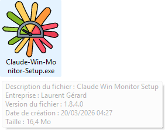

### 4.2 Alerte SmartScreen (si elle apparaît)

Windows peut afficher un écran bleu **"Windows a protégé votre ordinateur"**.

> Cette alerte apparaît pour tout logiciel nouvellement publié et non signé
> numériquement. Elle ne signifie pas que le fichier est dangereux.

**Étape 1** — Cliquez sur **Informations complémentaires**

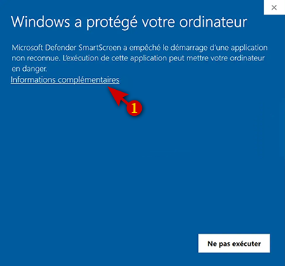

**Étape 2** — Cliquez sur **Exécuter quand même**

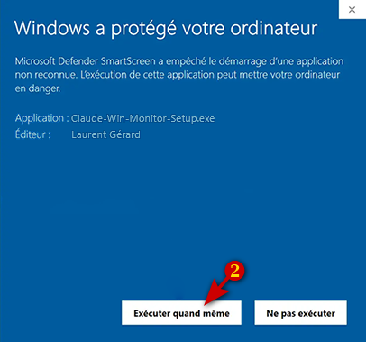

### 4.3 Étapes de l'assistant d'installation

> Les **zones en bleu** dans les captures ci-dessous indiquent des éléments
> **optionnels** que vous pouvez modifier si vous le souhaitez.
> Les **flèches rouges** indiquent le bouton à cliquer pour continuer.

---

**Étape 1 — Dossier de destination**

Le dossier proposé par défaut est `C:\Program Files (x86)\Claude-Win-Monitor`
(espace requis : ~59 Mo). Vous pouvez le modifier via **Parcourir**.
Cliquez sur **Suivant** ①.

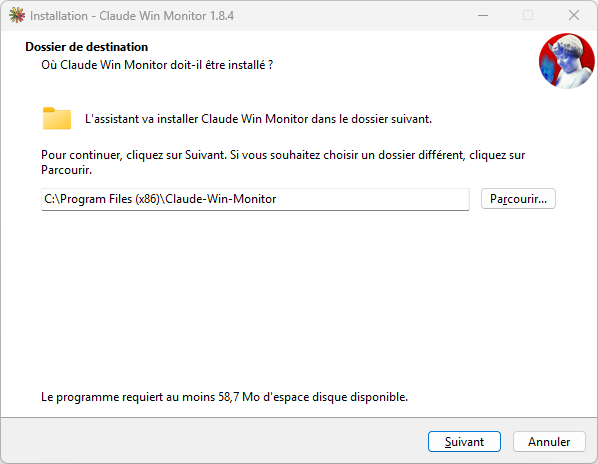

---

**Étape 2 — Dossier du menu Démarrer**

L'assistant créera un raccourci dans le menu Démarrer sous le nom **Claude Win Monitor**.
Vous pouvez modifier ce nom. Cliquez sur **Suivant** ①.

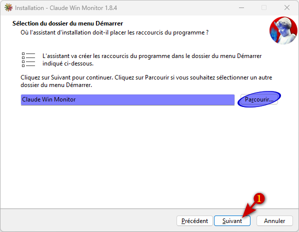

---

**Étape 3 — Prêt à installer**

Vérifiez le récapitulatif et cliquez sur **Installer** ①.

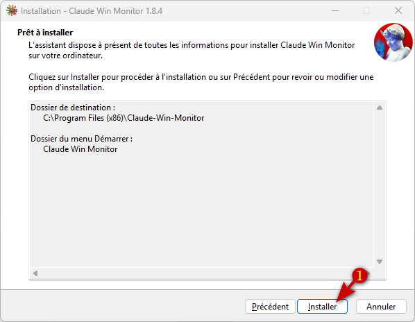

---

**Étape 4 — Fin de l'installation**

L'installation est terminée. Laissez la case **Lancer Claude Win Monitor** cochée
et cliquez sur **Terminer** ①.

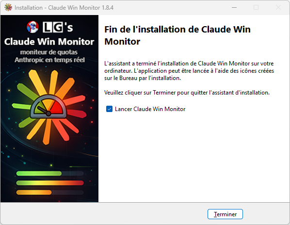

---

## 5. Après l'installation — exclusion antivirus

Réactivez votre antivirus et ajoutez une exclusion permanente sur le dossier
d'installation pour éviter toute détection future.

Chemin à exclure : `C:\Program Files (x86)\Claude-Win-Monitor`

La procédure varie selon votre antivirus — cherchez "Exclusions" ou "Exceptions"
dans les paramètres de votre logiciel de protection.

Claude Win Monitor est maintenant visible dans **Paramètres → Applications installées** :

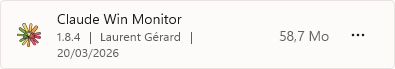

---

## 6. Installation de l'extension navigateur

### Pourquoi cette extension ?

Pour afficher vos statistiques, Claude Win Monitor a besoin de vos **identifiants
de session Anthropic** (une clé temporaire que Claude.ai génère à chaque connexion).

**L'extension récupère automatiquement cette clé** depuis votre navigateur et la
transmet à l'application — sans aucune intervention de votre part.

C'est la méthode la plus simple. Si vous préférez ne pas installer d'extension,
vous pouvez saisir la clé manuellement via le bouton **Paramètres** ⚙ de l'application
(procédure détaillée dans la fenêtre Paramètres).

### 6.1 Ouvrir la gestion des extensions

**Dans Chrome / Edge / Brave :** tapez `chrome://extensions` dans la barre d'adresse.

**Dans Arc :** cliquez sur le menu du navigateur (icône en haut à gauche)
→ **Extensions** → **Manage Extensions**.

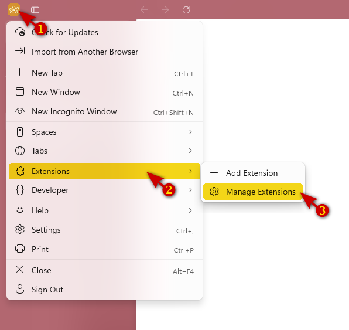

### 6.2 Activer le mode développeur et charger l'extension

1. Activez **Mode développeur** (bouton en haut à droite) — ①
2. Cliquez sur **Charger l'extension non empaquetée** — ②
3. Dans la fenêtre qui s'ouvre, naviguez jusqu'à l'archive dézippée
4. Sélectionnez le dossier **`2-Extension-Chrome`** et confirmez

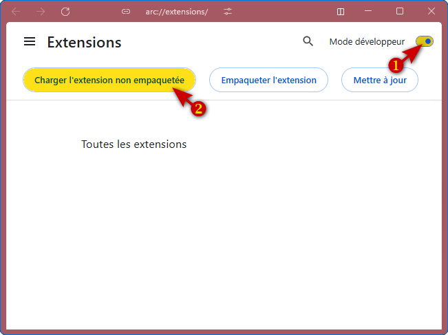

### 6.3 Vérifier l'installation

L'extension **Claude Session Helper** apparaît dans la liste, activée.

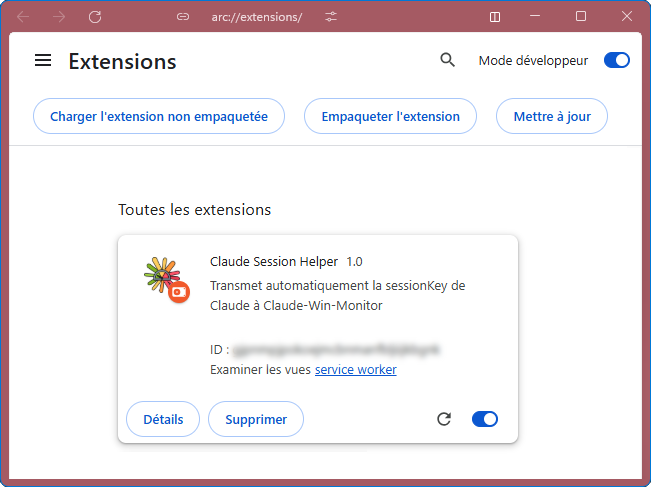

### 6.4 Alerte périodique du navigateur

Certains navigateurs affichent régulièrement un bandeau :
> *"Désactivez les extensions de développeur pour votre sécurité"*

Cliquez sur **Ignorer** ou **Ne plus afficher**. L'extension continuera
de fonctionner normalement.

---

## 7. Premier lancement

### 7.1 Connexion automatique

Si l'extension est installée et que vous êtes connecté à **claude.ai**,
la connexion s'effectue automatiquement en quelques secondes au démarrage.

L'application affiche vos quotas en temps réel :

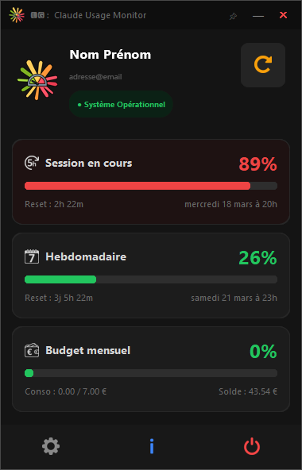

- **Session** — consommation sur les 5 dernières heures
- **Hebdomadaire** — consommation sur les 7 derniers jours
- **Budget mensuel** — consommation et solde du mois en cours

### 7.2 Connexion manuelle (si nécessaire)

Si la connexion automatique ne fonctionne pas :

1. Cliquez sur l'icône **Paramètres** ⚙ (barre du bas)
2. Suivez les instructions pour récupérer votre clé de session manuellement
   depuis les outils de développement du navigateur (F12)

### 7.3 Réinitialisation de la configuration

La configuration (clé de session) est enregistrée dans :
`C:\Users\[votre nom]\AppData\Local\Claude-Win-Monitor\claude_monitor_config.json`

> **Important :** si vous supprimez ce fichier, les statistiques continueront
> de s'afficher jusqu'à la prochaine fermeture de l'application (la configuration
> est chargée en mémoire au démarrage). **Relancez l'application** pour que la
> suppression soit prise en compte — l'assistant de configuration s'ouvrira alors
> automatiquement.

---

## 8. Icône dans la barre des tâches

Claude Win Monitor s'exécute en arrière-plan avec une icône dans la zone
de notification (coin inférieur droit de l'écran).

### 8.1 Icône masquée ?

Windows peut masquer l'icône dans le sous-menu "^" des icônes cachées.
Pour l'afficher en permanence :

**Paramètres** → **Personnalisation** → **Barre des tâches**
→ **Autres icônes de barre d'état système**
→ Activez **Moniteur de quotas Claude en temps réel**

### 8.2 Utilisation de l'icône

- **Survol** — affiche la consommation de session en cours directement dans
  la barre des tâches, sans ouvrir la fenêtre

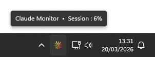

- **Clic gauche** — bascule la fenêtre au premier plan
- **Clic droit** — menu contextuel :
  - **Afficher** — ramener la fenêtre au premier plan
  - **Actualiser** — forcer une mise à jour des quotas
  - **Quitter** — fermer l'application

### 8.3 Garder la fenêtre au premier plan

La **punaise** 📌 dans la barre de titre permet de maintenir la fenêtre
au-dessus de toutes les autres fenêtres ouvertes.

### 8.4 Textes d'aide

La plupart des boutons et éléments affichent une **info-bulle** au survol
de la souris pour expliquer leur fonction.

---

## 9. Mise à jour

1. Téléchargez la nouvelle version de l'archive ZIP
2. Lancez le nouveau `Claude-Win-Monitor-Setup.exe`
3. Cliquez sur **Suivant** → **Installer** → **Terminer**

**Votre configuration est automatiquement conservée** — la clé de session
et les paramètres sont stockés dans un dossier séparé, jamais modifié
par l'installateur.

---

## 10. Désinstallation

1. **Paramètres Windows** → **Applications** → **Applications installées**
2. Recherchez **Claude Win Monitor** → **⋯** → **Désinstaller**

Votre configuration est conservée dans :
`C:\Users\[votre nom]\AppData\Local\Claude-Win-Monitor\`

Supprimez ce dossier manuellement pour une désinstallation complète.

---

## Assistance et signalement de problèmes

Communauté : [IA Mastery](https://www.skool.com/ia-mastery)

Code source : https://github.com/M0DR1SH/Claude-Win-Monitor

---

*🅻🅶's Claude Win Monitor v1.8.4 — Laurent Gérard — 2026*
